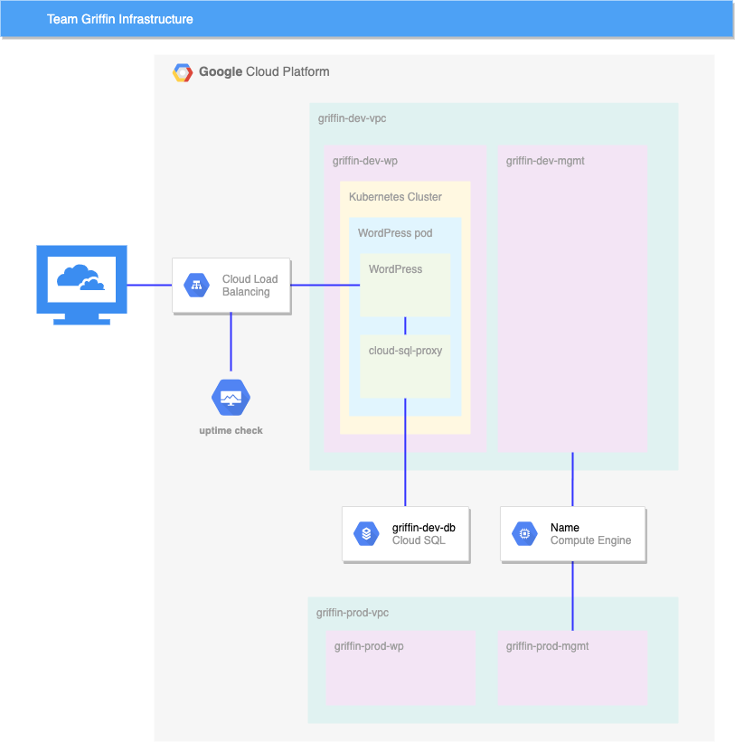

# Curso Google Cloud Engineer 
## Escola SENAI Mauá - Projeto conclusão do curso.
### Autor: Edilson F Souza
[](https://github.com/Edilsonfsp/google-cloud/blob/main/LICENSE)
# Cenário do desafio
Você precisa ajudar a equipe com algumas tarefas iniciais de um novo projeto. Ela pretende usar o WordPress e pediu que você configure um ambiente de desenvolvimento. Uma parte do trabalho já foi feita, mas outras requerem os conhecimentos de um especialista como você.
## Conhecimentos avaliados:
- Criar e usar VPCs e sub-redes
- Criar um cluster do Kubernetes
- Configurar e iniciar uma implantação e um serviço do Kubernetes
- Configurar o Stackdriver Monitoring
- Configurar um papel de IAM para uma conta
## Você deverá realizar as seguintes tarefas:
- Criar manualmente uma VPC de desenvolvimento com três sub-redes
- Criar uma VPC de produção com três sub-redes usando a configuração do Deployment Manager disponibilizada
- Criar um Bastion Host conectado às duas VPCs
- Criar uma instância de desenvolvimento do Cloud SQL e conectar e preparar o ambiente do WordPress
- Criar um cluster do Kubernetes na VPC de desenvolvimento para o WordPress
- Preparar o cluster do Kubernetes para o ambiente do WordPress
- Criar uma implantação do WordPress usando a configuração disponibilizada
- Ativar o monitoramento do cluster pelo Stackdriver
- Conceder acesso a outro engenheiro
## Veja algumas normas da Jooli Inc. que você precisa seguir:
- Crie todos os recursos na região ```informada no lab``` e na zona ```informada no lab```, a menos que haja uma instrução diferente.
- Use as VPCs do projeto.
- Os nomes têm o formato equipe-recurso. Por exemplo, o nome de uma instância pode ser ***kraken-webserver1***.
- Economize recursos. Como os projetos são monitorados, o uso excessivo de recursos pode levar ao encerramento desse projeto (e talvez da sua função). Por isso, tenha cuidado. Esta é a orientação da equipe de monitoramento: a menos que haja uma instrução diferente, use ```e2-medium```.
## Ambiente

## Crie a variável de ambiente do projeto
> ```
> # Digite os comandos
> $GOOGLE_CLOUD_PROJECT = cole aqui o ID do seu projeto.
> ```
## Tarefa 1. crie a VPC de desenvolvimento manualmente
> No Console do Google Cloud, no ***Menu de navegação***, clique em ***Redes > VPCs***.
> Crie uma VPC chamada ```griffin-dev-vpc``` com as seguintes sub-redes:
> - ```griffin-dev-wp```
> - Bloco de endereços IP: ```192.168.16.0/20```
> - ```griffin-dev-mgmt```
> - Bloco de endereços IP: ```192.168.32.0/20```
## Tarefa 2. Crie o VPC de produção manualmente
> Crie uma VPC chamada ```griffin-prod-vpc``` com as seguintes sub-redes:
> - ```griffin-prod-wp```
> - Bloco de endereços IP: ```192.168.48.0/20```
> - ```griffin-prod-mgmt```
> - Bloco de endereços IP: ```192.168.64.0/20```
> > ```
> > gcloud compute networks create griffin-dev-vpc --subnet-mode custom
> > gcloud compute networks subnets create griffin-dev-wp --network=griffin-dev-vpc --region <informada no lab> --range=192.168.16.0/20
> > gcloud compute networks subnets create griffin-dev-mgmt --network=griffin-dev-vpc --region <informada no lab> --range=192.168.32.0/20
> > ```
## Tarefa 3. crie um Bastion Host
> Crie um Bastion Host com duas interfaces de rede: uma conectada a ```griffin-dev-mgmt``` e a outra a ```griffin-prod-mgmt```. Verifique se é possível estabelecer uma conexão SSH com o host.
> No Console do Google Cloud, no ***Menu de navegação***, clique em ***Compute Engine > Instâncias de VM***.
> > ```
> > gcloud compute instances create bastion --network-interface=network=griffin-dev-vpc,subnet=griffin-dev-mgmt  --network-interface=network=griffin-prod-vpc,subnet=griffin-prod-mgmt --tags=ssh --zone=us-east1-b
> > gcloud compute firewall-rules create fw-ssh-dev --source-ranges=0.0.0.0/0 --target-tags ssh --allow=tcp:22 --network=griffin-dev-vpc
> > gcloud compute firewall-rules create fw-ssh-prod --source-ranges=0.0.0.0/0 --target-tags ssh --allow=tcp:22 --network=griffin-prod-vpc
> > ```
## Tarefa 4: crie e configure a instância do Cloud SQL
> Crie uma ***instância MySQL do Cloud SQL*** chamada ```griffin-dev-db``` em us-east1. Conecte-se à instância e execute os seguintes comandos SQL para preparar o ambiente do ***WordPress***:
> No console, selecione ***Menu de navegação > SQL***.
> 1. Clique em ***CRIAR INSTÂNCIA > Escolha MySQL*** .
> 2. Insira o ID da instância como ```griffin-dev-db```.
> 3. Digite uma senha forte no campo ***Senha*** (e anote!).
> 4. Selecione a versão do banco de dados ***MySQL 8***.
> 5. Em ***Escolher uma edição do Cloud SQL***, selecione ***Enterprise***.
> > Em ***Predefinição***, selecione ***Desenvolvimento*** (4 vCPU, 16 GB de RAM, 100 GB de armazenamento, zona única).  
> > ***Aviso***: se você selecionar uma predefinição maior que "Desenvolvimento", seu projeto será sinalizado e o laboratório será encerrado.
> 6. Defina o campo ***Várias zonas*** (altamente disponíveis) como ```<Lab Region>```
> 7. Clique em ***CRIAR INSTÂNCIA***.
>> Observação: a criação da instância pode levar alguns minutos. Depois disso, haverá uma marca de seleção verde ao lado do nome da instância na página de instâncias de SQL.
> > ```
> > # Criando por linha de comando
> > gcloud sql instances create griffin-dev-db --root-password 12345678 --region=us-east1 --database-version=MYSQL_5_7
> > ```
> 8. Clique na instância do Cloud SQL. A página Visão geral do SQL é aberta.
> 9. Essas instruções SQL criam o banco de dados "wordpress" e um usuário com acesso a ele.
> ```
> # Digite o comando coloque a senha configurada na criação do Cloud SQL
> gcloud sql connect griffin-dev-db
>
> # Digite os seguintes comandos na seção do Mysql
> MySQL [none]>CREATE DATABASE wordpress;
> MySQL [none]>CREATE USER "wp_user"@"%" IDENTIFIED BY "stormwind_rules";
> MySQL [none]>GRANT ALL PRIVILEGES ON wordpress.* TO "wp_user"@"%";
> MySQL [none]>FLUSH PRIVILEGES;
> MySQL [none]>Exit;
> ```
> > Você usará o nome de usuário: ***wp_user*** e a senha: ***stormwind_rules*** na tarefa 6.
## Tarefa 5. crie o cluster do Kubernetes
> Crie um cluster com dois nós (e2-standard-4) chamado ```griffin-dev``` na sub-rede ```griffin-dev-wp``` e na zona ```us-east1-b```.
> ```
> gcloud container clusters create griffin-dev \
>  --network griffin-dev-vpc \
>  --subnetwork griffin-dev-wp \
>  --machine-type e2-standard-4 \
>  --num-nodes 2 \
>  --location us-east1-b> 
> ```
> > ```
> > #Pegar as credenciais
> > gcloud container clusters get-credentials griffin-dev --zone us-east1-b
> > cd ~/
> > gsutil cp -r gs://cloud-training/gsp321/wp-k8s .
> > ```
## Tarefa 6. prepare o cluster do Kubernetes
> 1. Use o Cloud Shell e copie todos os arquivos em ```gs://cloud-training/gsp321/wp-k8s```.
> > ```
> > gsutil -m cp -r  gs://cloud-training/gsp321/wp-k8s .
> > cd wp-k8s
> > ```
> > O servidor do ***WordPress*** precisa acessar o banco de dados MySQL usando o nome de usuário:  ***wp_user*** e a senha: ***stormwind_rules*** que você criou na tarefa 4.
> 2. Para isso, configure os valores como secrets. O ***WordPress*** também precisa armazenar os próprios arquivos de trabalho fora do contêiner. Por isso, é necessário criar um volume.
> 3. Adicione os secrets e o volume a seguir ao cluster usando ```wp-env.yaml```.
> 4. Configure o nome de usuário como ```wp_user``` e a senha como ```stormwind_rules``` antes de criar a configuração.
> > Também será preciso informar a chave de uma conta de serviço que já foi configurada. Essa conta de serviço dá acesso ao banco de dados para um contêiner de sidecar.
> 5. Use o comando abaixo para criar a chave e depois a adicione ao ambiente do Kubernetes.
> > ```
> > gcloud iam service-accounts keys create key.json \
> >   --iam-account=cloud-sql-proxy@$GOOGLE_CLOUD_PROJECT.iam.gserviceaccount.com
> >   kubectl create secret generic cloudsql-instance-credentials \
> >   --from-file key.json
> > ```
## Tarefa 7. crie uma implantação do WordPress
> Agora que você já provisionou o banco de dados MySQL e configurou os secrets e o volume, crie a implantação usando ```wp-deployment.yaml```.
> 1. Antes de criar a implantação, é preciso editar o arquivo ```wp-deployment.yaml```.
> 2. Substituir ***YOUR_SQL_INSTANCE*** pelo ***nome da conexão da instância*** de griffin-dev-db.
> 3. É possível encontrar o ***nome da conexão da instância*** na instância do Cloud SQL.
> 4. Após criar a implantação do WordPress, crie o serviço usando o arquivo ```wp-service.yaml```.
> 5. Após criar o balanceador de carga, visite o site e verifique se o instalador de site do WordPress aparece. Agora a equipe de desenvolvimento pode terminar a instalação e você pode passar para a próxima tarefa.
> > 
## Tarefa 8. ative o monitoramento
> Crie uma verificação de tempo de atividade para o site de desenvolvimento do WordPress.
> > No Console do Google Cloud, no ***Menu de navegação***, clique em ***Monitoring > Health Check*** e clique em +Create Health check.
> > Name field: Escolha um nome qualquer
> > Clique next
> > Host name: Ip externo do load balance (Pode ser conseguido pelo comando kubctl get svc -w*)
> > path: /
> > clique em next
> > clique em create
## Tarefa 9. conceda acesso a outro engenheiro
> Outro engenheiro entrou para a equipe e precisa ter acesso ao projeto. Conceda a ele o papel de editor no projeto.
> A segunda conta de usuário do laboratório representa esse engenheiro.
> No Console do Google Cloud, no ***Menu de navegação***, clique em ***IAM > IAM***.
> > Coloque o papel de editor para User 2
> > ```
> >gcloud projects add-iam-policy-binding $DEVSHELL_PROJECT_ID --member=user:< cole o nome do usuario 2 do lab > --role=roles/editor
> > ```
